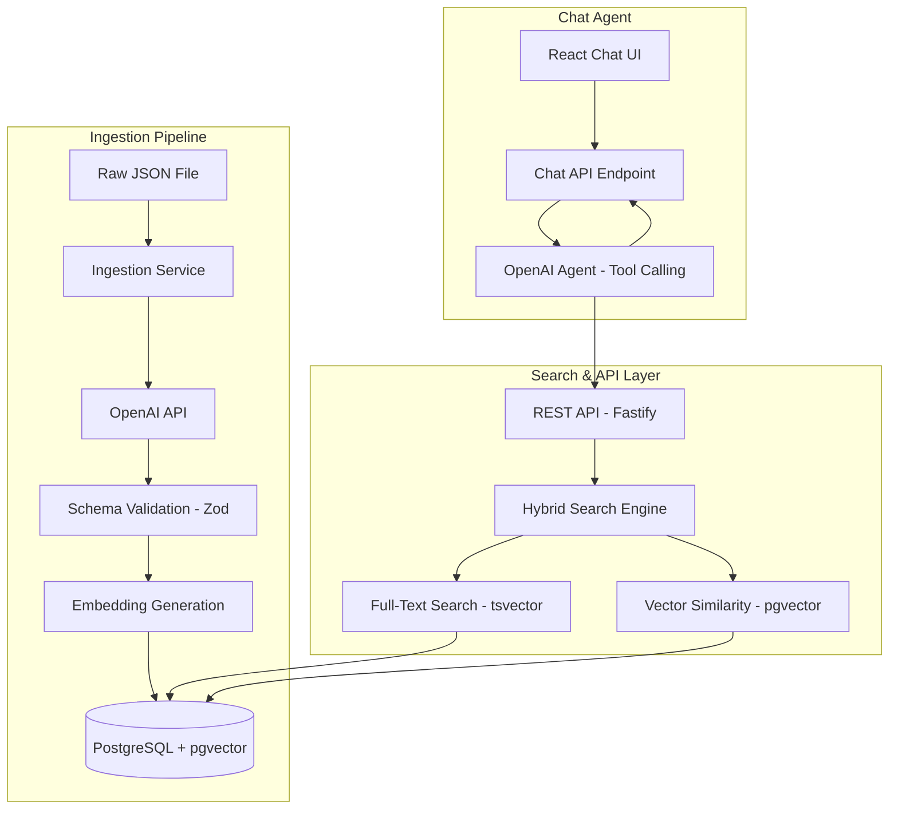
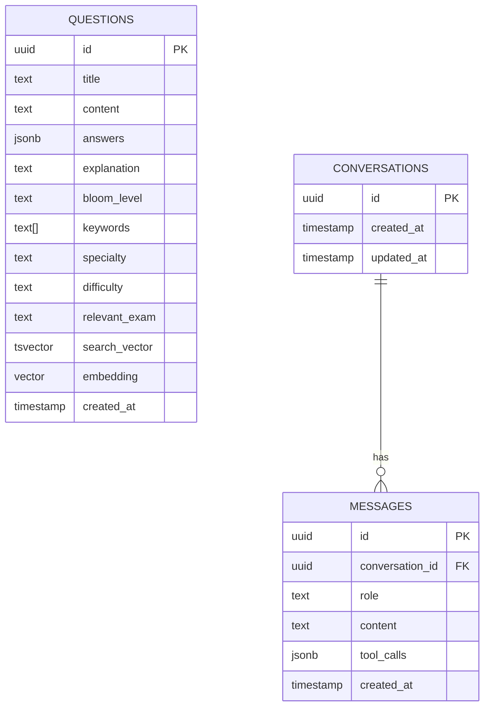

# Architecture & Design

## High-Level Architecture

## Component Overview

### Ingestion Pipeline
- **Ingestion Service**: Reads raw medical questions from a JSON file, sends each to the OpenAI API for enrichment, validates the response, generates embeddings, and stores the enriched data in PostgreSQL.
- **OpenAI API**: Used for two purposes:
  1. **Enrichment**: Classifies Bloom's Taxonomy level, extracts keywords, infers medical specialty, difficulty, and relevant exam.
  2. **Embeddings**: Generates vector embeddings of the question content for semantic search.
- **Schema Validation (Zod)**: Enforces a strict schema on LLM responses. If the LLM returns malformed data, the pipeline rejects and retries rather than indexing garbage.

### Search & API Layer
- **Fastify REST API**: Exposes search and chat endpoints. Uses Pino for structured logging out of the box.
- **Hybrid Search Engine**: Supports three search modes:
  1. **Query only (hybrid)**: Combines lexical full-text search (`tsvector`/`tsquery`) with semantic vector similarity (pgvector cosine distance). Results are scored using weighted combination (configurable, default 0.4 lexical / 0.6 semantic) and filtered by a combined score threshold (default 0.5).
  2. **Filters only**: When the agent requests questions by metadata (e.g., "all USMLE Step 1 questions") without a search query, the system skips embedding generation and returns all matching rows directly.
  3. **Query + filters**: Hybrid search within the filtered subset. Filter matches bypass the score threshold to ensure they are always included.
- **Configurable parameters** (via environment variables): similarity threshold, max results, lexical/semantic weights.

### Chat Agent
- **React Chat UI**: Minimal chat interface with markdown rendering for rich question formatting.
- **Chat API Endpoint**: Manages conversation history (persisted in PostgreSQL) and orchestrates the agent loop.
- **OpenAI Agent (Tool Calling)**: The LLM receives the user's message and can decide to call a `search_questions` tool. The tool supports both semantic queries and metadata filters (specialty, difficulty, bloom level, exam). The agent loop handles multiple tool call rounds if needed.
  - **Error handling**: Tool call failures are caught and returned to the agent as error messages, allowing it to respond gracefully rather than crashing the request.
  - **Result presentation**: The agent always presents results returned by the search tool, noting when they are loosely related rather than exact matches.

## Database Schema

## Technology Decision Record

### Search Engine Comparison

#### Option 1: PostgreSQL + pgvector

| Aspect | Assessment |
|--------|------------|
| **Lexical Search** | Built-in full-text search with `tsvector`/`tsquery`, supports fuzzy matching via `pg_trgm` |
| **Semantic Search** | pgvector extension provides vector storage and similarity operators (cosine, L2, inner product) |
| **Scalability** | Good for small-to-medium datasets (up to ~1M vectors). Performance degrades at larger scale without tuning. |
| **Maintenance** | Single system — no additional infrastructure. Standard PostgreSQL operations. |
| **Cost** | Low — single database instance. No per-query fees. |
| **Hybrid Search** | Both search types in a single query, scored and combined in SQL. |

#### Option 2: OpenSearch (AWS Managed)

| Aspect | Assessment |
|--------|------------|
| **Lexical Search** | Purpose-built — BM25 ranking, language analyzers, fuzzy matching, boosting, highlighting. Best-in-class. |
| **Semantic Search** | kNN plugin supports vector search with HNSW/IVF indexes. |
| **Scalability** | Excellent — designed for millions of documents with sub-second queries. Horizontal scaling. |
| **Maintenance** | Medium — AWS managed service handles infrastructure, but requires cluster configuration, index mapping design, and shard management. |
| **Cost** | Medium-to-high — dedicated cluster instances, storage, data transfer costs. |
| **Hybrid Search** | Native support for combining BM25 + kNN scores in a single query. |

#### Option 3: Pinecone + Secondary Index

| Aspect | Assessment |
|--------|------------|
| **Lexical Search** | Not supported — requires a separate system (e.g., OpenSearch, Postgres) for keyword matching. |
| **Semantic Search** | Excellent — purpose-built vector database, optimized for high-throughput similarity search. |
| **Scalability** | Excellent for vectors — serverless scaling, billions of vectors. |
| **Maintenance** | Low for vector part (fully managed), but high overall due to needing two separate systems. |
| **Cost** | Per-query pricing can add up. Plus the cost of a separate lexical search system. |
| **Hybrid Search** | Requires application-level merging of results from two different systems. Added complexity and latency. |

### Decision: PostgreSQL + pgvector (for PoC)

**Justification:**

1. **Single system**: Both lexical and semantic search in one database eliminates the need to manage multiple services and merge results at the application level.
2. **Zero infrastructure overhead**: Runs locally via Docker, no cloud services or API keys needed for the search layer.
3. **Fastest path to a working prototype**: Standard SQL — no new query DSL to learn. This lets us focus engineering effort on the AI pipeline and agent logic.
4. **Sufficient for the scale**: With 5-10 questions (and even up to ~100K), PostgreSQL handles this comfortably.

**Production recommendation:** For a production system at Lecturio's scale, **OpenSearch** is the stronger choice — it provides superior lexical search capabilities (BM25, analyzers, highlighting), proven horizontal scaling, and the team already has operational experience with it. Pinecone could complement OpenSearch if best-in-class vector performance becomes a bottleneck, but starting with OpenSearch alone provides both search types in a single managed service.

## Observability

### PoC: Structured Logging (Pino)

Fastify ships with Pino by default. Key events logged with structured metadata:

- **Ingestion**: LLM response time, token usage, validation pass/fail per question
- **Search**: Query latency, result count, score distribution, threshold filtering
- **Agent**: Tool calls made, turns per conversation, token usage per chat
- **Errors**: Failed LLM calls, rate limits, malformed responses

### Production: Full Observability Stack

For a production deployment, the structured logs serve as the foundation for a more complete stack:

- **OpenTelemetry**: Distributed tracing across ingestion pipeline, search, and agent — trace a single user query from the UI through the agent, search, and back.
- **Metrics (Prometheus/CloudWatch)**: Search latency (p50/p95/p99), LLM error rates, enrichment throughput, embedding generation time.
- **Dashboards (Grafana/CloudWatch)**: Real-time visibility into pipeline health, search quality, and cost tracking.
- **Alerting**: LLM validation failure rate spikes, search latency degradation, token budget approaching limits.
