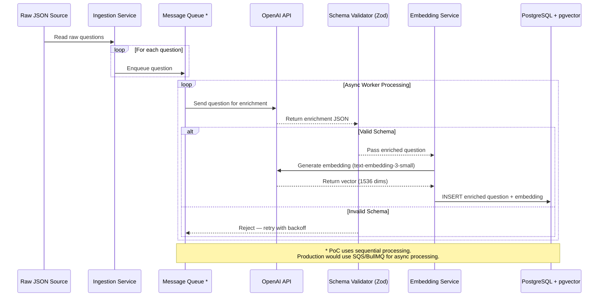
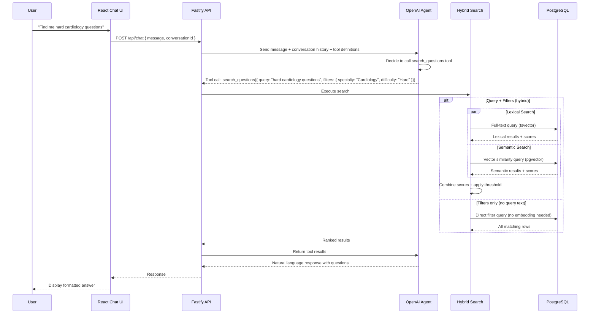
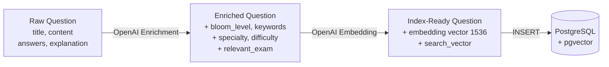

# Data Flow Diagram

## Question Lifecycle: Raw to Index-Ready

## Search Query Flow

## Data Transformation Detail

Shows the shape of data at each stage of the pipeline:

## Notes on Asynchronous Design

The PoC processes questions **sequentially** for simplicity. In a production environment, the pipeline would be fully asynchronous:

1. **Message Queue (SQS / BullMQ)**: Raw questions are enqueued and processed by independent workers. This decouples ingestion from enrichment, allowing the system to handle bursts of incoming data.

2. **Retry with Backoff**: If the LLM returns invalid data or the API is rate-limited, the message returns to the queue with exponential backoff. Dead-letter queues capture messages that fail repeatedly.

3. **Idempotency**: Each question has a unique ID. Workers check for duplicates before inserting, ensuring safe retries without double-indexing.

4. **Concurrency Control**: Multiple workers can process questions in parallel, with configurable concurrency to respect LLM rate limits and manage cost.
